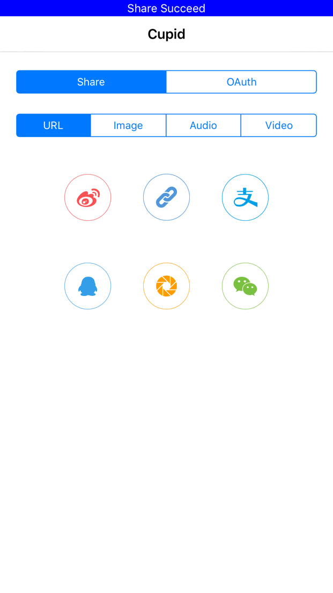

<p>
<a href="http://cocoadocs.org/docsets/Cupid"></a>
<a href="https://github.com/Carthage/Carthage/"></a>
</p>

# Cupid

Just like [openshare](https://github.com/100apps/openshare) and [MonkeyKing](https://github.com/nixzhu/MonkeyKing.git), Cupid helps you post messages or do OAuth to Social Networks. And more service providers is on the schedule. In fact, the network interface is the same as `MonkeyKing`. So why a new share SDK?

1. This library is coming with much more extensibility.
2. Most apps have their own network interface, so it is not necessary to maintain another network service instance.
3. You don't need to register at the app launch methods; I think that is a waste of memory, many people never share anything.
4. This library used many structs to construct the information channel, and use enums to construct information payload! No more singletons to reside in memory!
5. Protocols to extend custom functionality.

You can check [this article in Chinese](http://www.jianshu.com/p/bfa456a40d5f) to learn more about share architecture in our coming new version client.

**Not like demo of many library, this library's demo's logic is very similar to our architecture in our in programming new version client. The `MainViewController` is just like share sheet, though our client is coming with a much more beautiful interface. The `ShareManager` is our central hub for communication between the library and our app logic. The [NotificationManager](https://github.com/36Kr-Mobile/StatusBarNotificationCenter) is used for notification. So this demo does not show all the functionality of this library**

**If you want to share to Alipay, you must configure the app id and the bundle id to match your register to Alipay. If you have any questions, feel free to contact me or open an issue.**

## Features
1. [x] Share content to QQ, WeChat, Weibo, Pocket, Paste board, Alipay.
2. [x] OAuth to QQ(support web OAuth), WeChat, Weibo(Support web OAuth), Pocket(Support web OAuth).
3. [x] Subclass `ShareActivity` to create custom share UIActivity.
4. [x] Create your own service provider to offer more functionality.
5. [x] Optionally use your own network framework to do OAuth and share.
6. [ ] Code refactoring to make the web OAuth interface more customizable.
7. [ ] Code refactoring to make this library more elegant.

A quick peek of the demo, but just with the interface screenshot. Download it to try!




## Requirements

Swift 2.0+, iOS 8.0+

## Installation

It's recommended to use CocoaPods or Carthage.

### [CocoaPods](http://cocoapods.org)

To integrate Cupid into your Xcode project using CocoaPods, specify it in your `Podfile`:

```ruby
platform :ios, '8.0'
use_frameworks!

pod 'Cupid', '~> 1.0'
```

Then, run the following command:

```bash
$ pod install
```

You should open the `{Project}.xcworkspace` instead of the `{Project}.xcodeproj` after you installed anything from CocoaPods.

### [Carthage](https://github.com/Carthage/Carthage)

To integrate MonkeyKing into your Xcode project using Carthage, specify it in your `Cartfile`:

```ogdl
github "36Kr-Mobile/Cupid.git"
```

Then, run the following command to build the Cupid framework:

```bash
$ carthage update
```

## Usage

You can check the Cupid Demo to learn its usage, and also I recommend you to read this article to learn how we integrate this library into our own production code base.

## Contact

Shannon Wu

Twitter: [@inatu_](https://twitter.com/inatu_)

Weibo: [inatu](http://weibo.com/igenuis/profile?rightmod=1&wvr=6&mod=personinfo)

E-mail: [inatu@icloud.com](mailto:inatu@icloud.com)

## Credits

Great thanks to the creators and contributors of `MonkeyKing`, many methods are directly from it.

## License

Cupid is available under the [MIT License][mitLink] license. See the LICENSE file for more info.
[mitLink]:http://opensource.org/licenses/MIT
